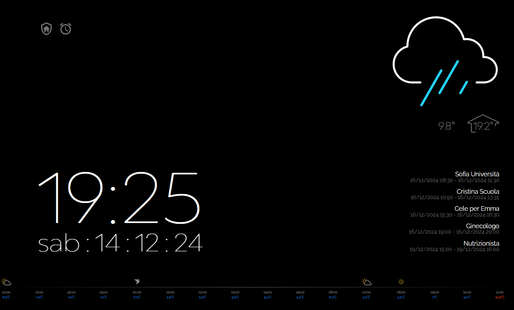
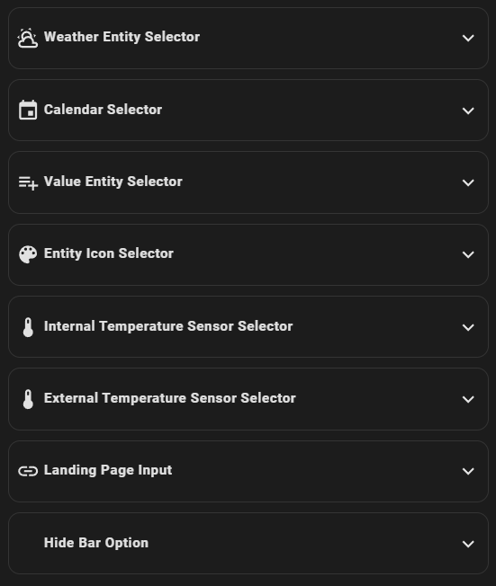
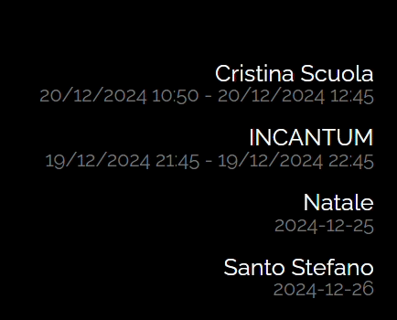
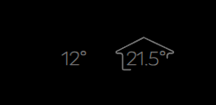
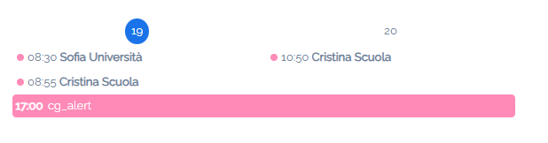
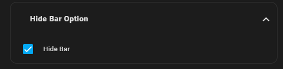

# lovelace Screensaver Card
### Custom scrrensaver card
best use: fully Kiosk
<hr>




the card was designed to be used with fully kiosks.
Fully Kiosk offers excellent screensaver management and gives the possibility to set a UI page as a screensevar.

This card must be used in panel mode.

It can also be used not combined with Fully Kiosk, but you will have to provide automation for its display.
in this case it is possible to set "landing_page:" to define the exit page from the screensaver.
this configuration is not necessary with fully kiosk

### the card has a pixel saving system

## Hacs Card Install

1. add madmicio/screensaver-card as custom reposity

2. Find and install `screensaver-card` plugin

2. Add a reference  inside your resources config:

  ```yaml
resources:
  - type: module
    url: /hacsfiles/screensaver-card/screensaver-card.js
```


### Manual install

1. Download and copy `screensaver-card.js`, `BwModelica-HairlineExpanded.otf`

 from (https://github.com/madmicio/screensaver-card/releases) into your custom components  directory.

2. Add a reference `screensaver-card.js` inside your resources config:

  ```yaml
  resources:
    - url: /local/"your_directory"/screensaver-cardd.js
      type: module
  ```


  # Config Editor
  
  # lovelace manual config example: 
```yaml
type: custom:screensaver-card
entity: weather.forecast_pasquale_ii
entity_icon:
  - entity: sensor.sun_next_dawn
    icon: mdi:account-plus
  - entity: zone.home
  - entity: switch.acquario_nightlight
  - entity: select.acquario_preset
  - entity: switch.shelly1pm_98cdac2de52a
  - entity: light.acquario
value_entity:
  - sensor.2_induzione_pc_channel_1_energy
  - sensor.2_induzione_pc_channel_1_power
  - sensor.2_induzione_pc_channel_2_voltage
  - light.acquario_segment_2
landing_page: /dashboard-test/bubble
internal_temperature: sensor.internal_temp
```
### Main Options
| Name | Type | Default | Supported options | Description |
| -------------- | ----------- | ------------ | ------------------------------------------------ | --------------------------------------------------------------------------------------------------------------------------------------------------------------------------------------------------------------------------------------------------------------------------------------------------------------------------------------------- |
| `type` | string | **Required** | `custom:screensaver-card` | Type of the card |
| `entity` | string | **Required** | entity | weather entity |
| `entity_icon` | string | **option** | entity list | state entity list |
| `value_entity` |  | **option**| entity list | icon entity list|
| `landing_page` |  | **Option**| url | landing page afther screensaver | 
| `internal_temperature` |  | **Option**| sensor | internal temperature sensor|
| `external_temperature` |  | **Option**| sensor | internal temperature sensor|
| `hide_bar` |  | **Option**| boolean | hide top & side bar|

  # info section
  in this section you can configure a list of entities.
their friendly name and status will be shown through value_entity:

alternatively you can show the events of the calendars configured in calendars:

if you configure both, the data will be shown alternately as shown in the video.



 # icon section


in this section you can configure a list of entities.
the icon will be shown if the entity is in on or in any case in an active state

 # temperature section


in this section only the temperature of the weather entity contiguated in entity will be shown by default:

if you configure an internal temperature sensor you will display the temperature as shown in the photo.

Furthermore, it is possible to configure your own external temperature sensor which will replace that of the weather entity.

# discreet alarm


this is a discreet alert that can be configured anonymously. 

use is very simple, just add the event to the calendar (existing or ad hoc) and the red dot will be displayed during the event.



### note: cg_alert events will never be shown in the card's calendar events list

# hide top bar & side Bar


for users who do not use kiosk mode by default to hide the top and side bar, the Hide_bar function is implemented in the card:

will automatically hide the bars when viewing the card and restore them when exiting