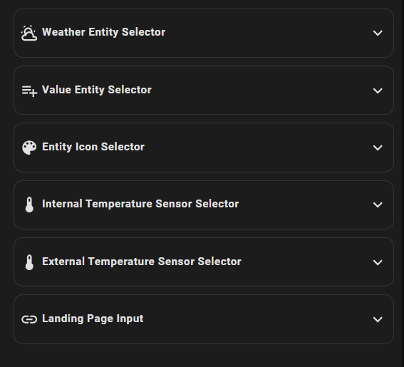

# lovelace Screensaver Card
### Custom scrrensaver card
best use: fully Kiosk
<hr>


## Hacs Card Install

1. add madmicio/screensaver-card as custom reposity

2. Find and install `screensaver-card` plugin

2. Add a reference  inside your resources config:

  ```yaml
resources:
  - type: module
    url: /hacsfiles/screensaver-card/screensaver-card.js
```


### Manual install

1. Download and copy `screensaver-card.js`, `BwModelica-HairlineExpanded.otf`

 from (https://github.com/madmicio/screensaver-card/releases) into your custom components  directory.

2. Add a reference `screensaver-card.js` inside your resources config:

  ```yaml
  resources:
    - url: /local/"your_directory"/screensaver-cardd.js
      type: module
  ```


  # Config Editor
  
  # lovelace manual config example: 
```yaml
type: custom:screensaver-card
entity: weather.forecast_pasquale_ii
entity_icon:
  - entity: sensor.sun_next_dawn
    icon: mdi:account-plus
  - entity: zone.home
  - entity: switch.acquario_nightlight
  - entity: select.acquario_preset
  - entity: switch.shelly1pm_98cdac2de52a
  - entity: light.acquario
value_entity:
  - sensor.2_induzione_pc_channel_1_energy
  - sensor.2_induzione_pc_channel_1_power
  - sensor.2_induzione_pc_channel_2_voltage
  - light.acquario_segment_2
landing_page: /dashboard-test/bubble
internal_temperature: sensor.internal_temp
```
### Main Options
| Name | Type | Default | Supported options | Description |
| -------------- | ----------- | ------------ | ------------------------------------------------ | --------------------------------------------------------------------------------------------------------------------------------------------------------------------------------------------------------------------------------------------------------------------------------------------------------------------------------------------- |
| `type` | string | **Required** | `custom:screensaver-card` | Type of the card |
| `entity` | string | **Required** | entity | weather entity |
| `entity_icon` | string | **option** | entity list | state entity list |
| `value_entity` |  | **option**| entity list | icon entity list|
| `landing_page` |  | **Option**| url | landing page afther screensaver | 
| `internal_temperature` |  | **Option**| sensor | internal temperature sensor|
| `external_temperature` |  | **Option**| sensor | internal temperature sensor|
